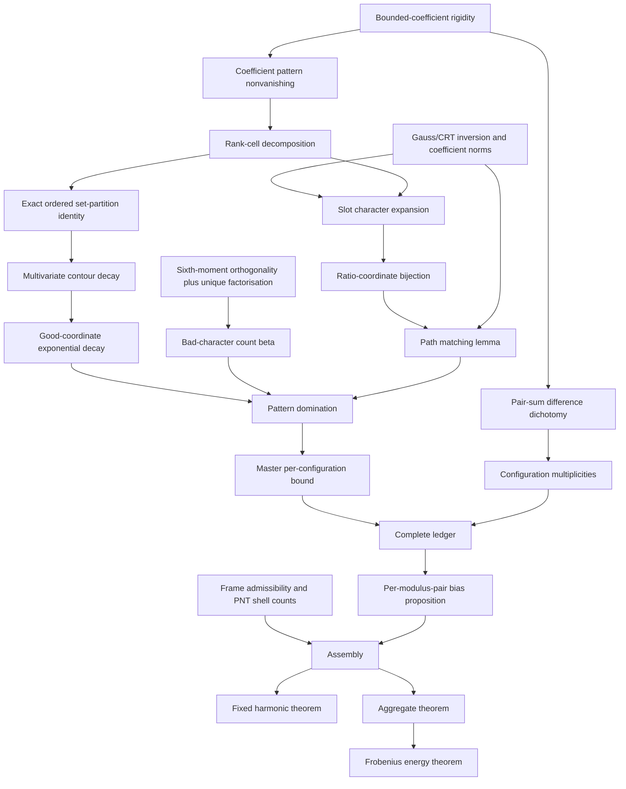

# Proof dependency graph

## Minimal cut set

The proof fails if any of the following is removed:

1. exact rank-conditioning rather than an independent-cell approximation;
2. a bad-character count of order at most `X polylog X`;
3. the two-slot Cauchy–Schwarz supremum bound in the interior-micro class;
4. the sliding-family multiplicity count in the short-window `m=2` sector;
5. the endpoint-orphan treatment; or
6. frame nondegeneracy for diagonal and harmonic aggregation.

## Non-load-bearing results

- exact sixth-moment polynomial;
- empirical Monte Carlo order ensembles;
- the block-averaged conditional Hardy–Littlewood proposition;
- the finite check of the sub-Weibull tail;
- any claim about the increasing order or Fortune's conjecture.
